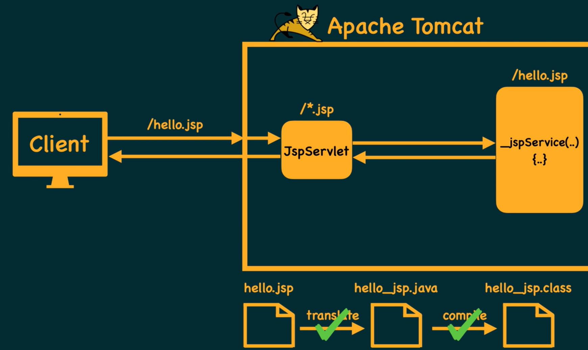
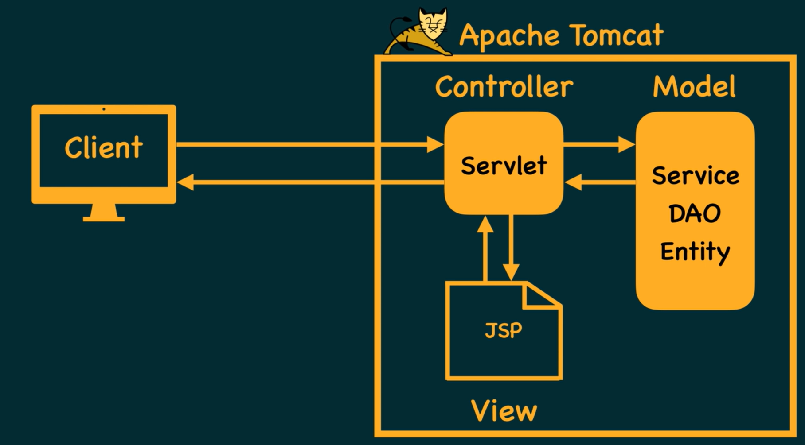

# JAva Server Pages:

- This replaces Servlets
- .jsp

- Since JSP is html we write all our code in html but use special brackest <% java code %> to embedd java code in jsp file
- Just like how Servlet is a java file we embed html same is
- In ideal scenario jsp should not contain any java code and so is vice versa
- Using MVC Model view controller we can archieve that.

