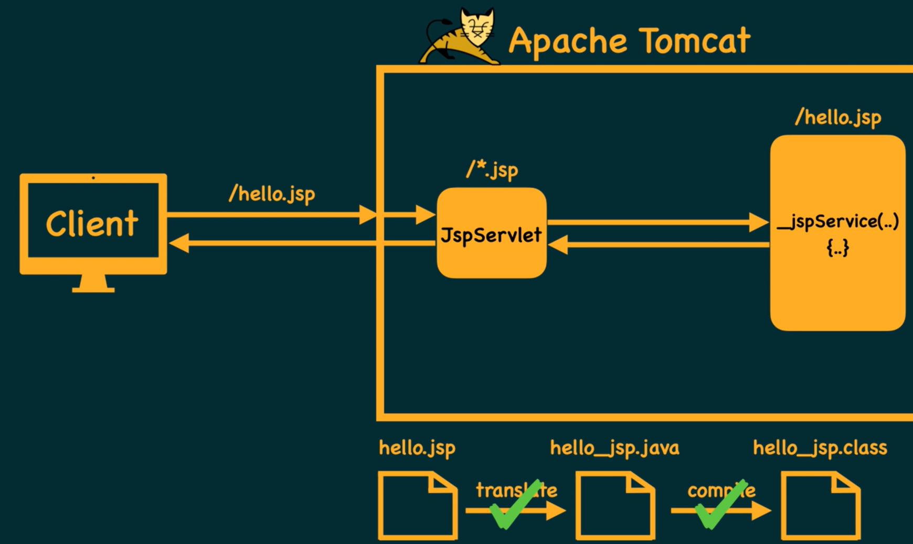
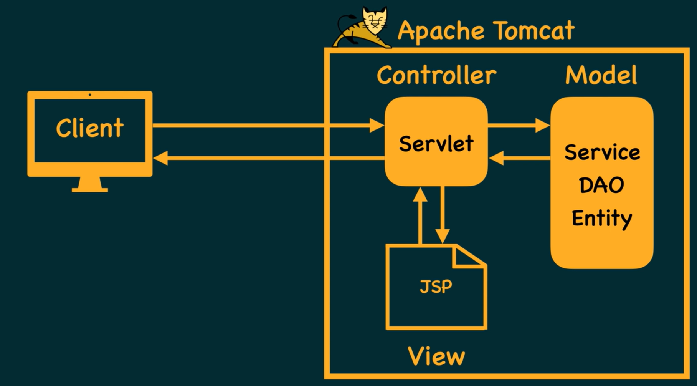
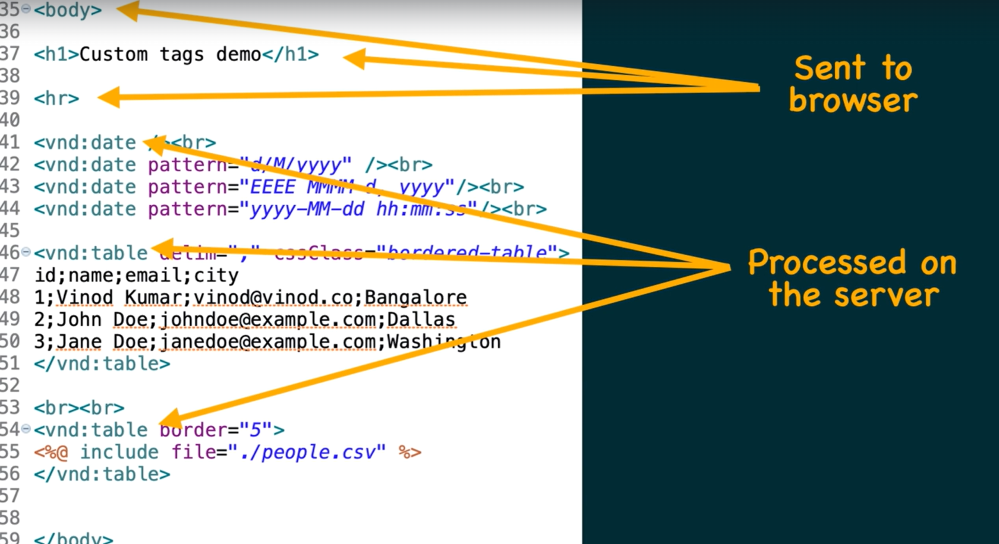
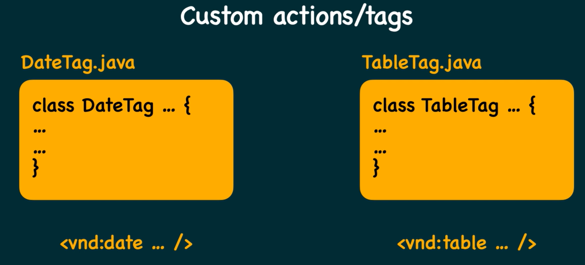

# JAva Server Pages:

- This replaces Servlets
- .jsp



- Since JSP is html we write all our code in html but use special brackest <% java code %> to embedd java code in jsp file
- Just like how Servlet is a java file we embed html same is
- In ideal scenario jsp should not contain any java code and so is vice versa
- Using MVC Model view controller we can archieve that.



- The temporary java files generated by web server can be found at

```
project_workspace\.metadata\.plugins\org.eclipse.wst.server.core\tmp0\work\Catalina\localhost\servlet-demo\org\apache\jsp
```

# JSP Elements

- Static elements: These elements
- Scripting Elements
  - Scriptlets: Java code inside <% Java code %> brackets
  - Declarations
  - Expressions
- Directives
- Actions
- Expression Language (EL) and JSTL

# Scripting elements

## Scriptlets:

- Java code inside <% Java code %> brackets.
- Becomes part of the service function of JSP -> Java
- Has access to implicit objects such as
  - request
  - response
  - out
  - session
- Can Do:
  - Can declare variables (become local to service)
  - Can use conditional statements
  - Can use loops
- Can Not Do:
  - Can not declare functions because its like writing a function inside a function
  - Can not create classes

## Declaration Block:

- Also a Java code written inside special brackets i.e.
- <%! Java Code %>
- Becomes part of the servlet class in Jsp -> Java
- Can not do:
  - Can not use loops
  - Can not use conditional statements because it is like writing a loop directly inside a class
- Can Do:
  - Can declare variables (become data members)
  - Can declare functions
  - Can create classes (nested classes)
  - Can declare static blocks
- Since the code written is not part of the service function
  - Has no access to implicit objects

## Expressions

- Becomes part of the service function JSP -> Java
- Embedded in HTML
- Used for printing value of variables/expressions

```
<%= expression %>
```

- Has access to implicit objects because they are part of the service function

# Directives

- Instruct the JSP translator before it can begin the translation of the jsp into java they can affect the actual source code of the jsp itself

```
<%@ dirName
   attr1="val1"
   attr2="val2"
%>
```

- Most Commonly used directives are
  - Page
  - Include
  - Taglib
- Page basically controlls appearance of the page
- Example: if you want to import other packages other than java.lang, controll page encoding, wether session object required or not, exception redirection in jsp

```
 <%@ page
    import="java.sql.*"
    encoding="UTF-8"
    session="false"
    errorPage="./err.jsp"
 %>
```

- Include: used for including any page file

```
<%@ include
    file="./header.jsp"
%>
```

- Taglib libraries custom made

```
<%@ taglib
    uri="my-custom-tag-library"
    prefix="vnd"
%>
```



# Actions

- Standard Actions no need to add additional jar files
  ```
  <jsp:useBean ... />
  <jsp:setProperty ... />
  <jsp:getProperty ... />
  <jsp:forward ... />
  <jsp:include ... />
  ```
  - Most of the times we don't have real requirements of these.
- Custom Actions
  - These are actions/tags made by developers.
  - Create a java class and use it as a tag.
  - 
  - 

# Expression Language (EL) and JSTL
- Replaced writing scriptlets, declarations and expressions in our jsp
- EL has syntax of
    ```
    ${ expression }
    ```
- Jsp Standard Type Library - JSTL
- Allow to do a lot of things using Jsp tags instead of scriplets and declarations