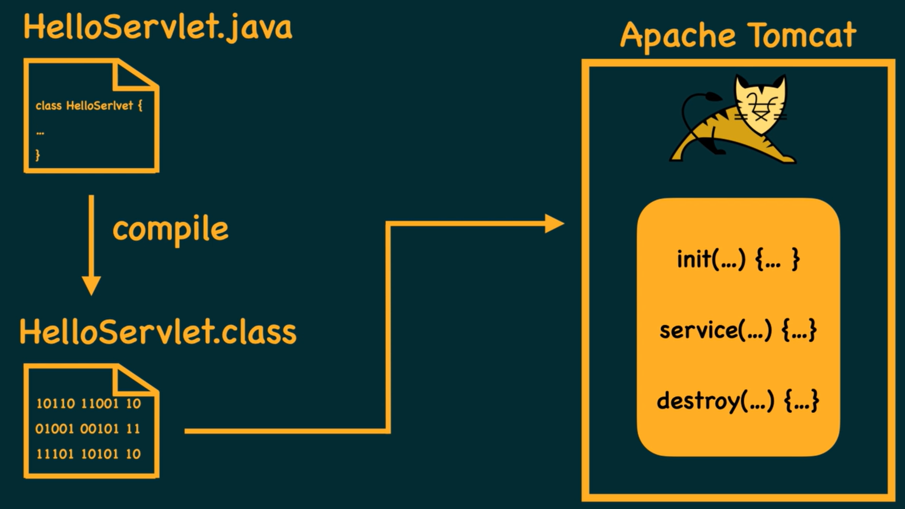
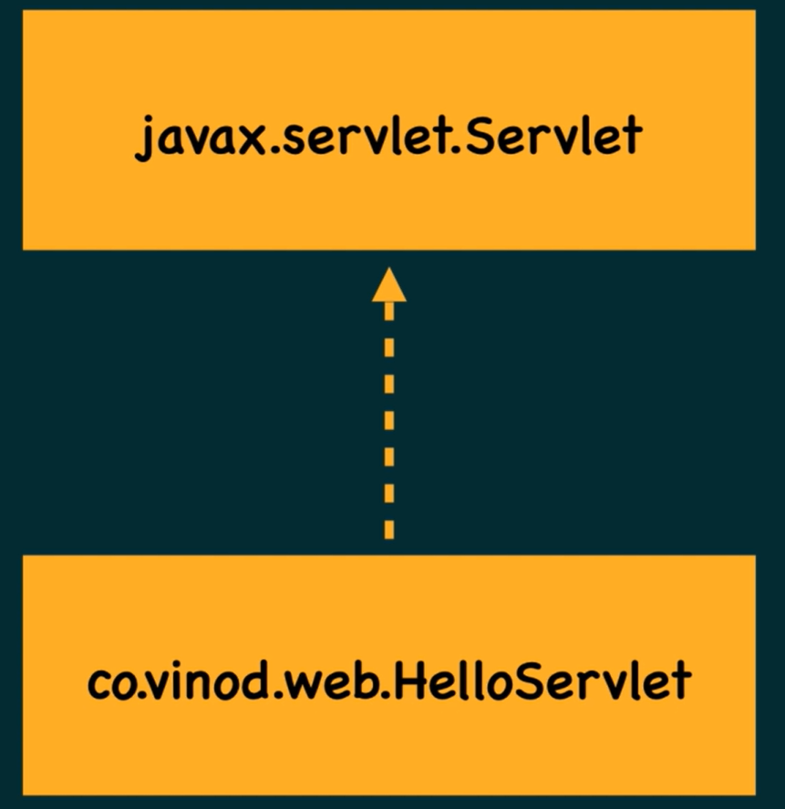

# Servlet, GenericServlet and HttpServlet

- Servlet is the core of java web application



- In order for a class to qualify as Servlet it has to implement the **javax.servlet.Servlet** interface



- This interface has 5 method signatures 3 lifecycle methods i.e.

```java
  void init(ServletConfig)
  void service(ServletRequest, ServletResponse)
  void destroy()
```

- And two additional

```java
  getServletInfo()
  getServletConfig()
```

- Servlet API provides a class called **javax.servlet.GenericServlet** which implements **javax.servlet.Servlet**
- The Generic Servlet class implements 4 of the 5 methods from the servlet interface leaving out only service method.
- Therefore our class can now just extend the Generic class and overide service method.

```java
void service(ServletRequest, ServletResponse)
```

- Also the **HttpServlet class** extends the Generic and implemenst contract service methods.

```java
void service(HttpServletRequest, HttpServletResponse)

void doGet(HttpServletRequest, HttpServletResponse)

void doPost(HttpServletRequest, HttpServletResponse)

void doPut(HttpServletRequest, HttpServletResponse)

void doDelete(HttpServletRequest, HttpServletResponse)

void doHead(HttpServletRequest, HttpServletResponse)

void doTrace(HttpServletRequest, HttpServletResponse)

void doOptions(HttpServletRequest, HttpServletResponse)
```

# MIME type

- Multipurpose Internet Mail Extension
- This is set before sending any response
- Describes format of data is it binary data like pdf, html, csv

```java
response.setContentType("text/html")
```

- Both character and binary streams are available
- Text content ==> Character stream
- response.getWriter() -> PrintWriter
- PrintWriter -> print(), println(), printf()
- out.close() -> important!
