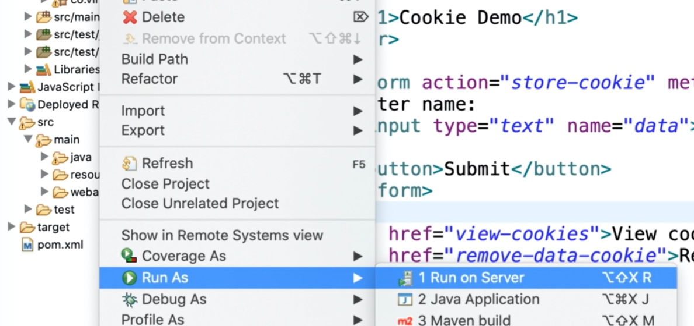

# Structure of the WAR file

- Stands for WebARchive, a standardized form of server java files to web server.


- Zipped file with extension .war and handed over to the web server
- It can be done manually


- but most of the time its the responsibility of the IDE where once you run the project its automatically packaged and served to the server



## WAR file consits

- **WEB-INF** folder which consists of files meant for the web server not client browser. Which consists of file known as **web.xml**

  - **Web.xml** also know as deployment descriptor
    - servlet API version 2.5 onwards its **optional**
    - Many of the feautures can now be declared via annotations
    - most common use is to defining and mapping Servlets
    - Information about
      - Listeners
      - Filters
      - Session timeout settings
      - security configurations
  - **classes** folders consisting of everything you have coded in form of classes and some configurations files
    - \*.class
    - \*.xml
    - \*.properties
  - **lib** folder consists of all additional files referred to by project
    - \*.jar
    - \*.zip
  - \*.jsp

- All files meant for the client such as _.html, _.css, _.js, _.png


Location for WEB-INF folder

```
\learn-springboot-microservices\.metadata\.plugins\org.eclipse.wst.server.core\tmp0\wtpwebapps\servlet-demo\WEB-INF
```


