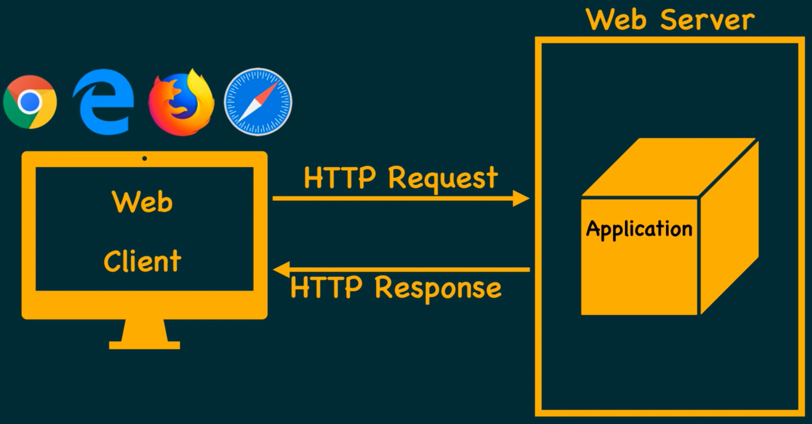
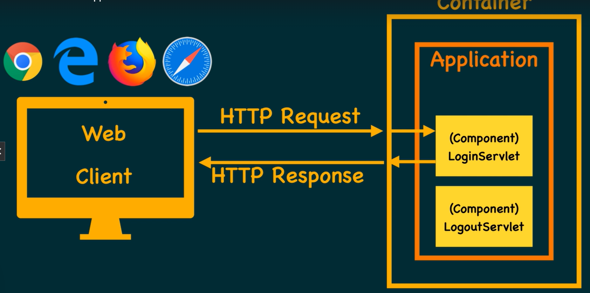
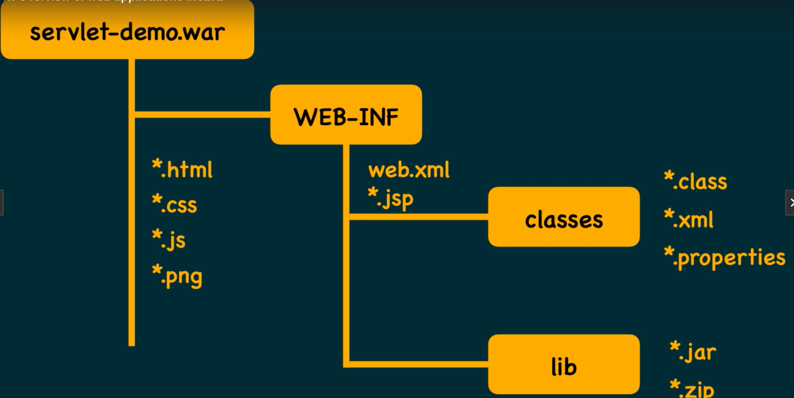
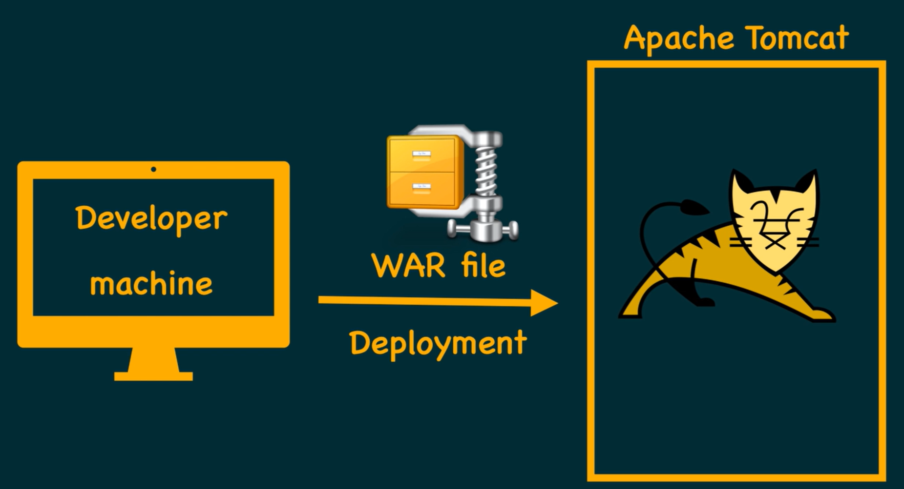

# Java EE web components - Servlets and JSP

- A software application
- Accessible on the internet
- Using Http protocol

## Static Web Application

- Only files as resources
- HTML/ CSS/ Javascript/ Images/ Videos/ PDF
- Server sends files (resources) on client request
- Nothing is executed on the server side

## Dynamic Web Application

- Server hosts one or more programs
- can be written in Java/ C#/ VB.net
- Other choices - PHP/ Python/ Ruby in Rails
- Recently popular - NodeJS

## Java EE

- Standardized by JCP (Java Community Process)
- Categorizes the app development into:
  - Functional requirements - **Components**
  - Non-functional requirements - **Containers**

## Functional requirements

- Application specific requirements
- Banking Application example
  - Existing account holders must be able to login.
  - Must be able to logout
  - View account details
  - Transfer funds to benefactors
- Shopping cart application examples
  - Customers may do self registration
  - May create multiple accounts
  - add items to cart, remove, change quantity
  - Checkout, add more addresses.

## Non Functional requirements

- These requirements are usually common to all applications
- concurrent request managements
- security
- Transaction management
- Covert HTTP requests to native (Java) objects
- Sesion management

## What do we develop?

- We address functional requirements
- so, create components
- Deploy them to containers.

## Java EE Containers

- Developed by organisations and individuals.
- Take care of non-functional requirements, but follow JCP standard specifications.
- **Tomcat** web container from Apache Software Foundation
- **Web Logic** from Oracle (previously BEA)
- **Web Sphere** from IBM
- **Glass Fish** from Sun Microsystem
- **JRun** from Adobe

## Java EE Components

- In Java there is only one type of component i.e. **Servlet**
- A user defined class that implements Servlet interface, and define all contract methods.
- Containers do not care about any other additional methods you may have in your components.
- Containers only execute standard servlet methods.

- Do not code to specific containers
- Code your components as per the standards set by Java EE Specification
- Standardized by the Java Community Process (http://jcp.org)
